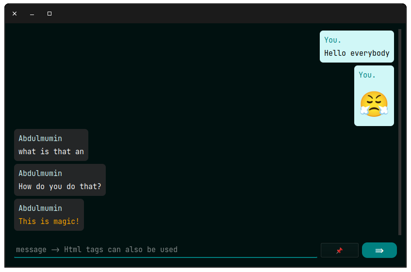
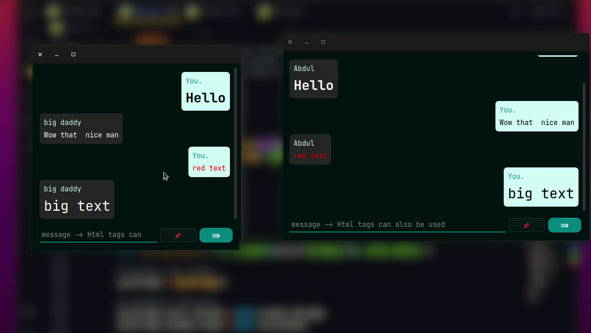

# ChatDesktopApp

a fully functioning messaging app built with python socket.




## Installing

#### Windows

download windows .exe [here]()

#### Linux

download linux .deb [here]()

### compile for you platform.

```bash
pip install -r requirements.txt

pip install pyinstaller

pyinstaller --onefile gui.py
```
